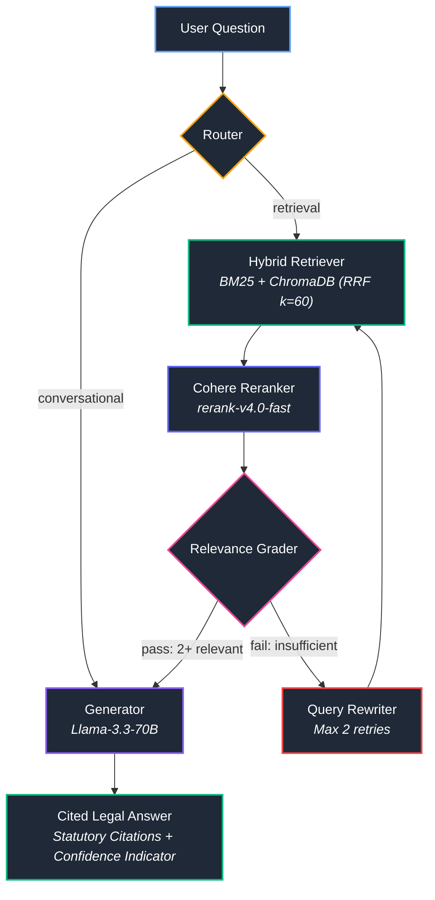

# Ontario Oversight CRAG — Agentic Corrective RAG for Police Oversight Legislation

[](https://www.python.org/downloads/)
[](https://github.com/langchain-ai/langgraph)
[](https://fastapi.tiangolo.com/)
[](https://streamlit.io/)
[](https://www.docker.com/)
[](LICENSE)

A production-grade **Corrective RAG (CRAG)** pipeline built to answer natural-language Quality Assurance and legal compliance questions grounded in Ontario police oversight legislation.

Every response is strictly grounded in public statutes, enforces precise legal citations (e.g. `[CSPA s.79(3)(a)]`), provides transparent confidence indicators, and refuses to extrapolate beyond retrieved legislative authority.

---

## What It Does

Interpreting provincial police oversight legislation is cognitively demanding and error-prone. The corpus spans hundreds of pages of legal text across:
- **Community Safety and Policing Act, 2019 (CSPA)**
- **28 Ontario Regulations** (e.g., O.Reg 392/23, 394/23)
- **16 Law Enforcement Complaints Agency (LECA)** Guideline PDFs
- **~1,868 indexed chunks** in a persistent vector index

**Ontario Oversight CRAG** solves the legal QA problem by implementing self-correcting retrieval and citation enforcement:
1. **Never Hallucinates General Knowledge:** If an answer cannot be located in the corpus, the system explicitly acknowledges the gap and suggests relevant statute topics.
2. **Deterministic Citation Enforcement:** Every substantive assertion must cite its statutory authority (`[CSPA s.X(Y)]`).
3. **Retrieval Confidence Scoring:** Computes confidence indicators (🟢 High / 🟡 Medium / 🔴 Low) derived from reciprocal rank fusion (RRF) scores.

---

## Architecture — Corrective RAG (LangGraph)

The pipeline is orchestrated as a state machine using **LangGraph**, applying the **Corrective RAG (CRAG)** architectural pattern:



### Node Specifications

| Node | Function | Model / Service | Latency |
|---|---|---|---|
| **Router** | Classifies query as `retrieval` or `conversational` | Groq `llama-3.3-70b-versatile` (temp=0) | ~300ms |
| **Hybrid Retriever** | BM25 keyword matching + ChromaDB dense search with Reciprocal Rank Fusion (k=60) | `rank_bm25` + ChromaDB (Cosine) | ~80ms |
| **Reranker** | Cross-encoder scoring of retrieved candidate pairs | Cohere `rerank-v4.0-fast` API | ~180ms |
| **Relevance Grader** | Evaluates candidate chunks; verifies at least 2 relevant sections | Groq `llama-3.3-70b-versatile` (temp=0) | ~350ms |
| **Query Rewriter** | Rewrites non-statutory or conversational phrasing into formal legislative language (max 2 retries) | Groq `llama-3.3-70b-versatile` (temp=0.3) | ~400ms |
| **Generator** | Synthesizes plain-language answer strictly bound to retrieved sections with bracketed citations | Groq `llama-3.3-70b-versatile` (temp=0.1) | ~1.2s |

---

## Key Engineering Decisions

1. **Why CRAG Over Naive RAG?**
   Naive RAG unconditionally feeds top-k retrieved chunks into the generator. In legal text, passing irrelevant or tangential sections causes severe legal hallucination or misattribution. CRAG adds an active grading gate: if retrieved chunks lack relevance, the query is rewritten into statutory terminology and retrieved again before synthesis.
2. **Hybrid Search via Reciprocal Rank Fusion (k=60):**
   Legal queries often contain exact numeric section tags (`s.11(1)`) or formal acronyms (`LECA`, `SIU`, `OPP`) where dense vector embeddings struggle. Conversely, broad semantic queries fail under pure keyword matching. Combining BM25Okapi and dense embeddings via Reciprocal Rank Fusion (RRF score = Σ 1 / (60 + rank)) captures both precision and conceptual recall.
3. **Cross-Encoder Reranking Before Grading:**
   RRF merges ranks without evaluating semantic relevance. Placing Cohere's cross-encoder reranker between RRF and the Grader ensures the most contextually relevant sections are evaluated first.
4. **Decoupled Client & Microservice Architecture:**
   FastAPI handles ingestion, embedding, vector search, and LangGraph execution. The Streamlit frontend interacts over REST, allowing independent scaling, separate container lifecycles, and zero heavy model dependencies in the UI.

---

## Evaluation & Benchmarks

The pipeline was benchmarked using an automated **LLM-as-a-Judge** framework evaluated against 12 complex statutory QA scenarios covering chief duties, misconduct complaint procedures, police service board obligations, and Inspector General powers.

> [!NOTE]
> Benchmark run on 2026-04-02 against the baseline production build (`evaluation/results_2026-04-02.json`). The open-source release differs only in naming, branding, and configuration defaults; retrieval and generation logic is unchanged.

- **Curated Benchmark Score:** **12/12 passed**
- **Citation Accuracy:** All 12 evaluation answers cited the correct statutory authority (e.g., `[CSPA s.79(3)(a)]`).
- **Topic Completeness:** Evaluated on multi-part statutory tests with >85% topic coverage per scenario.

Run evaluations locally:
```bash
python evaluation/run_eval.py
```

---

## Tech Stack

- **Orchestration:** LangGraph (StateGraph, conditional edges, retry loops)
- **Inference:** Groq API (`llama-3.3-70b-versatile`)
- **Embeddings:** OpenRouter API (`openai/text-embedding-3-small`, 1536-dimensional)
- **Reranker:** Cohere API (`rerank-v4.0-fast`)
- **Vector Database:** ChromaDB (persistent, cosine distance)
- **Lexical Search:** `rank_bm25` (BM25Okapi)
- **Backend:** FastAPI, Pydantic v2, Uvicorn
- **Frontend:** Streamlit with custom CSS design, theme toggle, and Word session export (`python-docx`)
- **Containerization:** Docker Compose (multi-container microservice)

---

## Quickstart

### Option 1: Docker Compose (Recommended)

1. **Clone the repository:**
   ```bash
   git clone https://github.com/shahin13700/ontario-oversight-crag.git
   cd ontario-oversight-crag
   ```

2. **Configure environment variables:**
   ```bash
   cp .env.example .env
   ```
   Open `.env` and configure your API keys:
   - `GROQ_API_KEY`: Free at [console.groq.com](https://console.groq.com)
   - `OPENROUTER_API_KEY`: Available at [openrouter.ai](https://openrouter.ai)
   - `COHERE_API_KEY`: Available at [cohere.com](https://cohere.com)

3. **Start services:**
   ```bash
   docker compose up --build
   ```
   > **Note on Initial Indexing:** On the initial startup, if the ChromaDB vector store is unindexed, the FastAPI backend will automatically chunk and embed the ~1,868 legislative sections into `chroma_db/`. This process takes approximately 2–3 minutes. Subsequent startups are instantaneous.

4. Open your browser to `http://localhost:8501`.

---

### Option 2: Local Python Virtual Environment

1. **Create and activate a virtual environment:**
   ```bash
   python -m venv .venv

   # Windows
   .venv\Scripts\activate

   # Linux / macOS
   source .venv/bin/activate
   ```

2. **Install dependencies:**
   ```bash
   pip install -r requirements.txt
   ```

3. **Setup environment:**
   ```bash
   cp .env.example .env
   # Edit .env and supply your API keys
   ```

4. **Index documents (first run only):**
   ```bash
   python scripts/index_all.py
   ```

5. **Run the Streamlit application:**
   ```bash
   streamlit run src/ui/app.py
   ```

---

## Testing

The project includes an extensive unit test suite covering chunking, lexical retrieval, hybrid RRF fusion, and vector operations.

To run tests offline without external API dependencies:
```bash
pytest tests/
```

To run linter checks (syntax and undefined names):
```bash
ruff check --select E9,F63,F7,F82 .
```

---

## Repository Structure

```
ontario-oversight-crag/
├── data/raw/                 # Public statutes: CSPA 2019 .docx, Regulations, LECA PDFs
├── evaluation/               # LLM-as-a-judge evaluation harness & test QA pairs
├── scripts/                  # Batch indexing and verification scripts
├── src/
│   ├── agent/                # LangGraph state machine, conditional edges, and nodes
│   │   ├── nodes/            # router, retriever, reranker, grader, rewriter, generator
│   │   ├── graph.py          # StateGraph compilation
│   │   └── state.py          # AgentState schema
│   ├── api/                  # FastAPI backend server
│   ├── embeddings/           # OpenRouter embeddings client (1536-d)
│   ├── ingestion/            # Statutory docx and PDF chunking engines
│   ├── retrieval/            # BM25, hybrid retriever, RRF, and confidence scoring
│   ├── ui/                   # Streamlit production and local UI + Word export
│   └── vectorstore/          # ChromaDB collection management
├── tests/                    # Pytest test suite
├── docker-compose.yml        # Two-tier service composition (API + UI)
├── Dockerfile.api            # Backend container definition
├── Dockerfile.ui             # Streamlit container definition
├── ARCHITECTURE.md           # Exhaustive technical reference
└── README.md
```

---

## Data Attribution & Legal Notice

- **Statutes & Regulations:** The text of the *Community Safety and Policing Act, 2019* and associated Regulations are © King's Printer for Ontario and are sourced from [Ontario e-Laws](https://www.ontario.ca/laws). Used in accordance with the Ontario e-Laws Terms of Use.
- **Guideline Publications:** Practice guidelines and materials are © Law Enforcement Complaints Agency (LECA) and are used for statutory QA analysis.
- **Software Codebase:** Distributed under the [MIT License](LICENSE).
