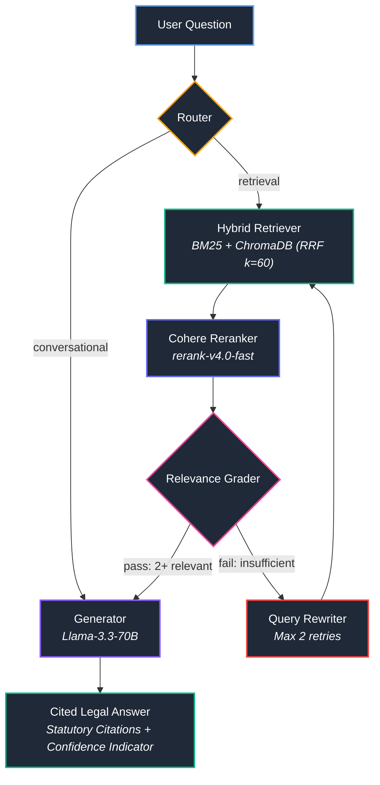

# Police Oversight CRAG — Agentic Corrective RAG for Law Enforcement Legislation

[](https://github.com/shahin13700/police-oversight-crag/actions/workflows/ci.yml)
[](https://www.python.org/downloads/)
[](https://github.com/langchain-ai/langgraph)
[](https://fastapi.tiangolo.com/)
[](https://streamlit.io/)
[](https://www.docker.com/)
[](LICENSE)

An agentic **Corrective RAG (CRAG)** pipeline built with LangGraph to answer natural-language compliance and quality assurance questions over police oversight legislation, using Ontario's policing legislative framework as the reference knowledge base.

Every response is strictly grounded in retrieved statutory text, enforces verifiable legal citations (e.g. `[CSPA s.102(4)(a)]`), provides transparent retrieval confidence indicators, and suggests relevant legislative topics when an answer cannot be located in the corpus.

---

## Example Q&A (Verbatim Benchmark Output)

Below is an actual query and generation output from the committed benchmark run ([`evaluation/results_2026-04-02.json`](evaluation/results_2026-04-02.json), Question 3):

> **User Query:**  
> *"What types of compliance or quality reviews can the Inspectorate of Policing conduct under public legislation?"*
>
> Based on the provided legislative sections, the Inspector General is authorized to conduct specific monitoring, inspections, and analyses to ensure compliance and address policing complaints. The provided text outlines the following types of reviews and oversight activities:
>
> 1.  **Compliance Inspections and Monitoring:** The Inspector General must monitor and conduct inspections of police service boards, chiefs of police, police services, and prescribed policing providers to ensure they comply with the Act and the regulations [CSPA s.102(4)(a)].
> 2.  **Board Member Misconduct Inspections:** The Inspector General must monitor and conduct inspections of members of police service boards to ensure that they do not commit misconduct [CSPA s.102(4)(c)].
> 3.  **Compliance Research and Analysis:** The Inspector General is required to develop, maintain, and manage records and conduct research and analyses regarding compliance with the Act and the regulations [CSPA s.102(4)(d)].
> 4.  **Complaint-Based Reviews:** The Inspector General deals with complaints regarding the adequacy and effectiveness of policing, failures to comply with the Act (other than misconduct), and policies or procedures established by boards or chiefs [CSPA s.102(4)(e)] [CSPA s.107(1)].
> 5.  **Compliance Consultation:** The Inspector General consults with and advises police service boards and chiefs of police regarding compliance with the Act and the regulations [CSPA s.102(4)(b)].
>
> Additionally, police service boards and chiefs of police are required to implement their own quality assurance processes relating to the provision of adequate and effective policing and compliance with the Act and regulations, which falls under the scope of regulatory compliance [O. Reg. 392/23 s.23].
>
> ### Sources
> *   CSPA s.102(4) — Inspector General's duties
> *   CSPA s.107(1) — Policing complaints
> *   O. Reg. 392/23 s.23 — Quality assurance
>
> LLM Judge Score: 0.93 / 1.00

---

## What It Does

Interpreting provincial police oversight legislation is cognitively demanding and error-prone. The corpus spans hundreds of pages of legal text across:
- **Community Safety and Policing Act, 2019 (CSPA)**
- **28 Ontario Regulations** (e.g., O. Reg. 392/23, O. Reg. 394/23)
- **12 Law Enforcement Complaints Agency (LECA)** Practice Guidelines and Rules of Procedure
- **~1,843 indexed chunks** in a persistent vector index (see [`data/raw/MANIFEST.md`](data/raw/MANIFEST.md))

**Police Oversight CRAG** implements a self-correcting legal retrieval pipeline:
1. **Corpus Grounding & Topic Routing:** The generator prompt strictly confines answers to retrieved statutory context and states when information is not found in the corpus while suggesting relevant legislative topics; the relevance grader gates generation on ≥2 relevant chunks.
2. **Deterministic Statutory Citations:** Every substantive assertion must cite its statutory authority (`[CSPA s.X(Y)]`, `[O. Reg. 392/23 s.23]`, `[LECA Guideline 001]`).
3. **Retrieval Confidence Scoring:** Computes confidence indicators (🟢 High / 🟡 Medium / 🔴 Low) derived from reciprocal rank fusion (RRF) scores.

---

## Architecture — Corrective RAG (LangGraph)

The pipeline is orchestrated as a state machine using **LangGraph**, applying the **Corrective RAG (CRAG)** architectural pattern:



### Node Specifications

| Node | Function | Model / Component |
|---|---|---|
| **Router** | Classifies query as `retrieval` or `conversational` | Groq `llama-3.3-70b-versatile` (temp=0) |
| **Hybrid Retriever** | BM25 keyword matching + ChromaDB dense search with Reciprocal Rank Fusion (k=60) | `rank_bm25` + ChromaDB (Cosine) |
| **Reranker** | Cross-encoder scoring of retrieved candidate pairs | Cohere `rerank-v4.0-fast` API |
| **Relevance Grader** | Evaluates candidate chunks; verifies at least 2 relevant sections | Groq `llama-3.3-70b-versatile` (temp=0) |
| **Query Rewriter** | Rewrites non-statutory or conversational phrasing into formal legislative language (max 2 retries) | Groq `llama-3.3-70b-versatile` (temp=0.3) |
| **Generator** | Synthesizes plain-language answer strictly bound to retrieved sections with bracketed citations | Groq `llama-3.3-70b-versatile` (temp=0.1) |

*For in-depth node implementations, prompts, and schema details, see [`ARCHITECTURE.md`](ARCHITECTURE.md).*

---

## Key Engineering Decisions

1. **Why CRAG Over Naive RAG?**  
   Naive RAG unconditionally feeds top-k retrieved chunks into the generator. In legal text, passing irrelevant or tangential sections causes severe legal hallucination or misattribution. CRAG adds an active grading gate: if retrieved chunks lack relevance, the query is rewritten into statutory terminology and retrieved again before synthesis.
2. **Hybrid Search via Reciprocal Rank Fusion (k=60):**  
   Legal queries often contain exact numeric section tags (`s.11(1)`) or formal acronyms (`LECA`, `SIU`, `OPP`) where dense vector embeddings struggle. Conversely, broad semantic queries fail under pure keyword matching. Combining BM25Okapi and dense embeddings via Reciprocal Rank Fusion ($RRF = \sum \frac{1}{60 + rank}$) captures both keyword precision and conceptual recall.
3. **Cross-Encoder Reranking Before Grading:**  
   RRF merges ranks without evaluating semantic relevance. Placing Cohere's cross-encoder reranker between RRF and the Grader ensures the most contextually relevant sections are evaluated first.
4. **Decoupled Client & Microservice Architecture:**  
   FastAPI handles ingestion, embedding, vector search, and LangGraph execution. The Streamlit frontend interacts over REST, allowing independent scaling, separate container lifecycles, and zero heavy model dependencies in the UI.

---

## Evaluation & Benchmark Results

The pipeline was benchmarked using an automated **LLM-as-a-Judge** framework evaluated against 12 complex statutory QA scenarios covering chief duties, misconduct complaint procedures, police service board obligations, and Inspector General powers.

> [!NOTE]
> Benchmark run on 2026-04-02 against the baseline production build ([`evaluation/results_2026-04-02.json`](evaluation/results_2026-04-02.json)). The open-source release differs only in naming, branding, and configuration defaults; retrieval and generation logic is unchanged.

### Aggregate Metrics

- **Benchmark Pass Rate:** **12/12 passed (100%)**
- **Citation Accuracy:** **12/12 passed (100%)** — All 12 evaluation answers cited verified statutory authority (e.g., `[CSPA s.102(4)(a)]`).
- **LLM Judge Average:** **0.93 / 1.00**
  - **Faithfulness:** **1.00 / 1.00** (mean 0.996) — Grounded strictly in retrieved legislative excerpts without external hallucinations.
  - **Relevance:** **0.93 / 1.00** — Directly answers the regulatory scenario.
  - **Completeness:** **0.85 / 1.00** — Comprehensive coverage of statutory provisions.
- **Statutory Topic Coverage:** **65.0% mean** across multi-point legislative criteria (range: 20% to 80%).

### Per-Scenario Evaluation Table

The table below reflects the exact per-question results from the committed benchmark receipt ([`evaluation/results_2026-04-02.json`](evaluation/results_2026-04-02.json)):

| # | Category | Scenario Summary | Citation Verified | Topic Coverage | LLM Judge Avg | Faithfulness | Relevance | Completeness | Status |
|---|---|---|:---:|:---:|:---:|:---:|:---:|:---:|:---:|
| 1 | Foundational Oversight & QA | QA expectations for Ontario police services | Passed | 80% | 1.00 | 1.00 | 1.00 | 1.00 | Passed |
| 2 | Foundational Oversight & QA | Oversight bodies and operational roles | Passed | 80% | 1.00 | 1.00 | 1.00 | 1.00 | Passed |
| 3 | Inspectorate of Policing | Compliance and quality reviews by IG | Passed | 60% | 0.93 | 1.00 | 1.00 | 0.80 | Passed |
| 4 | Inspectorate of Policing | Public evidence examined during inspections | Passed | 80% | 0.90 | 1.00 | 0.90 | 0.80 | Passed |
| 5 | Complaints & Standards | LECA quality assurance expectations | Passed | 80% | 0.93 | 1.00 | 1.00 | 0.80 | Passed |
| 6 | Complaints & Standards | Public complaints role in governance | Passed | 60% | 0.92 | 1.00 | 0.90 | 0.85 | Passed |
| 7 | Risk & Continuous Improvement | Risk identification & monitoring expectations | Passed | 80% | 1.00 | 1.00 | 1.00 | 1.00 | Passed |
| 8 | Risk & Continuous Improvement | Systematic failure & continuous improvement | Passed | 60% | 0.93 | 1.00 | 0.90 | 0.90 | Passed |
| 9 | QA Checklists | Public complaints handling QA checklist | Passed | 60% | 0.93 | 1.00 | 1.00 | 0.80 | Passed |
| 10 | QA Checklists | Use of force reporting & review checklist | Passed | 40% | 1.00 | 1.00 | 1.00 | 1.00 | Passed |
| 11 | QA Checklists | Detention & custody management QA questions | Passed | 20% | 0.68 | 0.95 | 0.60 | 0.50 | Passed |
| 12 | QA Checklists | Detention & custody QA checklist | Passed | 80% | 0.90 | 1.00 | 0.90 | 0.80 | Passed |

Run evaluations locally:
```bash
python evaluation/run_eval.py
```

---

## Limitations

1. **Corpus Snapshot:** Corpus snapshot committed April 2026; consult [Ontario e-Laws](https://www.ontario.ca/laws) for amendments enacted after this snapshot.
2. **Single-Hop Statutory Scope:** Designed for direct statutory interpretation over the CSPA, associated regulations, and LECA guidelines. It does not synthesize multi-hop case law precedents or federal criminal statutes (e.g., Criminal Code of Canada).
3. **Evaluation Suite Size:** The automated LLM-as-a-Judge benchmark is validated across 12 curated multi-scenario evaluations.
4. **External API Dependencies:** Requires operational API keys for Groq (`llama-3.3-70b-versatile`), OpenRouter (`openai/text-embedding-3-small`), and Cohere (`rerank-v4.0-fast`).
5. **Language:** English-language statutory texts and queries only.

---

## Prerequisites

- Python 3.11+
- Docker (optional)
- `GROQ_API_KEY` ([console.groq.com](https://console.groq.com), free tier)
- `COHERE_API_KEY` ([dashboard.cohere.com](https://dashboard.cohere.com), free trial tier)
- `OPENROUTER_API_KEY` ([openrouter.ai](https://openrouter.ai), pay-per-use; one-time corpus indexing costs under $0.01)

---

## Quickstart

### Option 1: Docker Compose (Recommended)

1. **Clone the repository:**
   ```bash
   git clone https://github.com/shahin13700/police-oversight-crag.git
   cd police-oversight-crag
   ```

2. **Configure environment variables:**
   ```bash
   cp .env.example .env
   ```
   Open `.env` and configure your API keys:
   - `GROQ_API_KEY`: Free at [console.groq.com](https://console.groq.com)
   - `OPENROUTER_API_KEY`: Available at [openrouter.ai](https://openrouter.ai)
   - `COHERE_API_KEY`: Available at [cohere.com](https://cohere.com)

3. **Start services:**
   ```bash
   docker compose up --build
   ```
   > **Note on Initial Indexing:** On initial startup, if the ChromaDB vector store is unindexed, the FastAPI backend will automatically chunk and embed the ~1,843 legislative sections into `chroma_db/`. This process takes approximately 2–3 minutes. Subsequent startups are instantaneous.

4. Open your browser to `http://localhost:8501`.

---

### Option 2: Local Python Virtual Environment

1. **Create and activate a virtual environment:**
   ```bash
   python -m venv .venv

   # Windows
   .venv\Scripts\activate

   # Linux / macOS
   source .venv/bin/activate
   ```

2. **Install dependencies:**
   ```bash
   pip install -r requirements.txt
   ```

3. **Configure environment:**
   ```bash
   cp .env.example .env
   # Edit .env and supply your API keys
   ```

4. **Index documents (first run only):**
   ```bash
   python scripts/index_all.py
   ```

5. **Run the Streamlit application:**
   ```bash
   streamlit run src/ui/app.py
   ```

---

## Testing

The project includes an offline unit test suite covering chunking, lexical retrieval, hybrid RRF fusion, and vector operations.

To run tests offline without external API dependencies:
```bash
pytest tests/
```

To run linter checks:
```bash
ruff check --select E9,F63,F7,F82 .
```

---

## Data Attribution & Legal Notice

- **Statutes & Regulations:** The text of the *Community Safety and Policing Act, 2019* and associated Regulations are © King's Printer for Ontario and are sourced from [Ontario e-Laws](https://www.ontario.ca/laws). Used in accordance with the Ontario e-Laws Terms of Use.
- **Guideline Publications:** Practice guidelines and materials are © Law Enforcement Complaints Agency (LECA) and are used for statutory QA analysis.
- **Data Manifest:** See [`data/raw/MANIFEST.md`](data/raw/MANIFEST.md) for full document listings, regulation numbers, and source links.
- **System Architecture:** See [`ARCHITECTURE.md`](ARCHITECTURE.md) for detailed component references and LangGraph state wiring.
- **Software License:** Distributed under the [MIT License](LICENSE).
